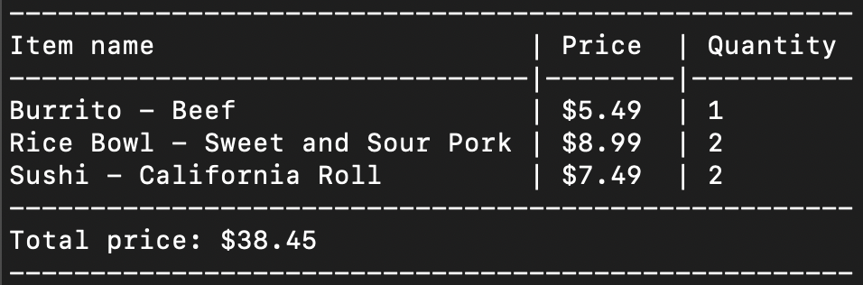

# Order System - Python

## Description

I wanted to apply the pythonic principles that I had been developing over the course of a week. This type of app is ideal for implementing many of the core python principles.
This app allows the user to select from a predetermined menu of food items. The user also has the ability to choose the number of each item selected. At the end of the user's selection phase, the total amount will be tallied  based on the number of items selected and their cost. 

## Table of Contents

- [Installation](#installation)
- [Usage](#usage)
- [Contributions](#contributions)
- [License](#license)
- [Badge](#badge)
- [Questions](#questions)

## Installation

In the intergrated terminal, run the command py order_system.py.

## Usage
 The repo is free to use as a reference for apps of this type.
 
 
 

## License

MIT

## Badge

## Contributions

To contribute, do not hesitate to contact me below. The application is done and produces the intended behavior. But for other suggestions and contributions, you can find my email attached. 

## Tests

There are no tests to run.

## Questions 

[Email me](mailto:raheemsenegal@outlook.com) or you can find me at my [GitHub](github.com/raheem-senegal).
